## 綜合資產配置報告 (單位: USD)

- **累積外部投入金額**：41,142.53 USD
- **實際淨投入資金**：41,142.53 USD
- **最終組合市值**：95,699.17 USD
- **總獲利**：54,556.64 USD
- **總獲利百分比**：132.60%
- **AnnVol**：25.08%
- **MaxDD**：53.04%
- **Sharpe**：0.59
- **Sortino Ratio**：0.76
- **Calmar Ratio**：0.27
- **綜合 XIRR**：31.16%

## 綜合資產配置報告 (單位: TWD)

- **累積外部投入金額**：1,262,151.50 TWD
- **實際淨投入資金**：1,262,151.50 TWD
- **最終組合市值**：3,015,863.48 TWD
- **總獲利**：1,753,711.98 TWD
- **總獲利百分比**：138.95%
- **AnnVol**：24.47%
- **MaxDD**：45.51%
- **Sharpe**：0.69
- **Sortino Ratio**：0.88
- **Calmar Ratio**：0.37
- **綜合 XIRR**：33.61%

## 綜合投資組合股票明細 (TWD)
| Symbol             | Name               |   Quantity_now |     Price | AvgCost   |   Price_Total |      Cost | Price PnL(USD)                                                  | Price PnL(TWD)                                                   | Dividend(USD)                                                  | Dividend(TWD)                                                   | Total PnL(USD)                                                  | Total PnL(TWD)                                                   | Total PnL(%)                                                  | Alloc(%)         |
|--------------------|--------------------|----------------|-----------|-----------|---------------|-----------|-----------------------------------------------------------------|------------------------------------------------------------------|----------------------------------------------------------------|-----------------------------------------------------------------|-----------------------------------------------------------------|------------------------------------------------------------------|---------------------------------------------------------------|------------------|
| 0050               | 0050               |              0 |   0       |           |         0     |   739.039 | -40.25    | -1,268.35  | 42.87    | 1,270.00  | 2.62      | 1.65       | 0.35%   | 0.00% (0)        |
| 2330               | 台積               |              0 |   0       |           |         0     |  1421.47  | 128.89    | 4,061.93   | 21.89    | 611.00    | 150.79    | 4,672.93   | 10.61%  | 0.00% (0)        |
| 2376               | 技嘉               |              0 |   0       |           |         0     |   311.776 | 551.42    | 17,377.57  | 71.47    | 2,245.00  | 622.89    | 19,622.57  | 199.79% | 0.00% (0)        |
| 006208             | 006208             |           4037 |   7.42051 | 2.67      |     29956.6   | 10782     | 19,174.61 | 604,268.69 | 1,365.39 | 42,916.00 | 20,540.01 | 647,184.69 | 148.69% | 31.65% (944,052) |
| 2884               | 玉山金             |              0 |   0       |           |         0     |   209.043 | 7.46      | 234.95     | 22.42    | 721.00    | 29.88     | 955.95     | 14.29%  | 0.00% (0)        |
| 0056               | 0056               |              0 |   0       |           |         0     |   337.345 | -10.68    | -336.41    | 17.50    | 486.00    | 6.83      | 149.59     | 2.02%   | 0.00% (0)        |
| 00646              | 元大SP&500         |              0 |   0       |           |         0     |  4121.59  | -108.71   | -3,425.81  | 0.00                                                           | 0.00                                                            | -108.71   | -3,425.81  | -2.64%  | 0.00% (0)        |
| 00631L             | 00631L             |          18668 |   1.07254 | 0.16      |     20022.2   |  2998.53  | 17,023.63 | 536,482.64 | 0.00                                                           | 0.00                                                            | 17,023.63 | 536,482.64 | 310.19% | 21.16% (630,978) |
| TQQQ               | TQQQ               |              0 |   0       |           |         0     |  6175.88  | 3,441.68  | 108,461.10 | 138.50   | 4,364.69  | 3,580.18  | 112,825.79 | 57.97%  | 0.00% (0)        |
| EDV                | EDV                |              1 |  63.415   | 851.05    |        63.415 |   851.05  | -787.63   | -24,821.53 | 392.72   | 12,376.18 | -394.91   | -12,445.35 | -5.35%  | 0.07% (1,998)    |
| TMF                | TMF                |              0 |   0       |           |         0     |    57.79  | -42.06    | -1,325.48  | 0.00                                                           | 0.00                                                            | -42.06    | -1,325.48  | -72.78% | 0.00% (0)        |
| VOO                | VOO                |              0 |   0       |           |         0     |  3425.97  | 507.63    | 15,997.45  | 25.17    | 793.21    | 532.80    | 16,790.66  | 15.55%  | 0.00% (0)        |
| SPYM               | SPYM               |            203 |  87.36    | 68.19     |     17734.1   | 13842     | 3,892.07  | 122,654.70 | 137.43   | 4,330.97  | 4,029.50  | 126,985.67 | 27.05%  | 18.74% (558,872) |
| QLD                | QLD                |            275 |  93.09    | 54.05     |     25599.7   | 14863.8   | 10,735.98 | 338,333.64 | 30.25    | 953.30    | 10,766.23 | 339,286.94 | 72.43%  | 27.05% (806,750) |
| TSLA               | TSLA               |              1 | 405.397   | 317.37    |       405.397 |   317.37  | 88.03     | 2,774.10   | 0.00                                                           | 0.00                                                            | 88.03     | 2,774.10   | 27.74%  | 0.43% (12,776)   |
| UNH                | UNH                |              1 | 404.16    | 253.20    |       404.16  |   253.2   | 150.96    | 4,757.35   | 4.42     | 139.29    | 155.38    | 4,896.65   | 61.37%  | 0.43% (12,737)   |
| QQQ270115P00350000 | QQQ270115P00350000 |            100 |   1.79    | 3.60      |       179     |   359.66  | -180.66   | -5,693.32  | 0.00                                                           | 0.00                                                            | -180.66   | -5,693.32  | -50.23% | 0.19% (5,641)    |
| TSM270115P00200000 | TSM270115P00200000 |            100 |   2.77    | 8.26      |       277     |   825.66  | -548.66   | -17,290.47 | 0.00                                                           | 0.00                                                            | -548.66   | -17,290.47 | -66.45% | 0.29% (8,729)    |

## 投組 vs. Benchmark 總表 (TWD)
| Asset        | Final Value (TWD)   | Profit (TWD)                                                       | Profit %                                                      | XIRR %                                                       | AnnVol %   | MaxDD %   |   Sharpe |
|--------------|---------------------|--------------------------------------------------------------------|---------------------------------------------------------------|--------------------------------------------------------------|------------|-----------|----------|
| My Portfolio | 3,015,863.48        | 1,753,711.98 | 138.95% | 33.61% | 24.47%     | 45.51%    |     0.69 |
| SPY          | 2,063,392.80        | 801,241.29   | 63.48%  | 18.66% | 18.12%     | 18.85%    |     0.83 |
| QQQ          | 2,368,003.14        | 1,105,851.63 | 87.62%  | 24.02% | 23.24%     | 28.78%    |     0.78 |
| EWT          | 2,967,960.34        | 1,705,808.84 | 135.15% | 32.97% | 23.45%     | 29.15%    |     0.86 |

## Target Allocation And Rebalance Suggestion
Rebalance capital pool (stocks only): 2,940,653 TWD
|       Asset |   Target % |   Current % |   Current Amount (TWD) |   Target Amount (TWD) |                                         Suggested Action (TWD) |
|-------------|------------|-------------|------------------------|-----------------------|----------------------------------------------------------------|
|         QLD |      30.0% |       27.4% |                806,750 |               882,196 |  +75,445 |
| SPLG / SPYM |      25.0% |       19.0% |                558,872 |               735,163 | +176,291 |
|      00631L |      15.0% |       21.5% |                630,978 |               441,098 | -189,880 |
|      006208 |      30.0% |       32.1% |                944,052 |               882,196 |  -61,857 |
Stock performance chart saved to output/stock_performance.png

## Put Protection Analysis
This is a full-portfolio stress test. Every current non-put holding is shocked by a simple asset-type rule, then current puts are revalued and added back.
Put: QQQ270115P00350000, Strike $350.0, Exp 2027-01-15 (Underlying: QQQ @ $719.11)
Put: TSM270115P00200000, Strike $200.0, Exp 2027-01-15 (Underlying: TSM @ $429.71)
Current non-put assets: $94,186 USD
Current put market value: $456 USD
| Put | Underlying | Current Market Value | Put Notional |
| :--- | :--- | ---: | ---: |
| QQQ270115P00350000 | QQQ | $179 | $71,911 |
| TSM270115P00200000 | TSM | $277 | $42,971 |
| Holding | Current Value | Stress Rule |
| :--- | ---: | :--- |
| 006208 | $29,957 | Broad equity exposure |
| QLD | $25,600 | 2x equity exposure |
| 00631L | $20,022 | 2x equity exposure |
| SPYM | $17,734 | Broad equity exposure |
| TSLA | $405 | High beta equity 1.5x |
| UNH | $404 | Defensive equity 0.8x |
| EDV | $63 | Long Treasury +5% in bear market |
| Scenario | Base Drop | Total Assets (Unhedged) | Total Assets (Hedged) | Total Puts Value | Protection |
| :--- | :--- | :--- | :--- | :--- | :--- |
| Current | 0% | $94,186 | **$94,642** | $456 | +$456 |
| Correction | -10% | $80,199 | **$80,205** | $6 | +$6 |
| Bear Market | -20% | $66,216 | **$66,413** | $198 | +$198 |
| Crash | -30% | $52,235 | **$53,502** | $1,267 | +$1,267 |
| Crisis | -40% | $38,249 | **$42,162** | $3,913 | +$3,913 |
| Collapse | -50% | $24,718 | **$33,087** | $8,368 | +$8,368 |
Chart saved to output/total_asset_protection.png

## Charts

### Asset Trend
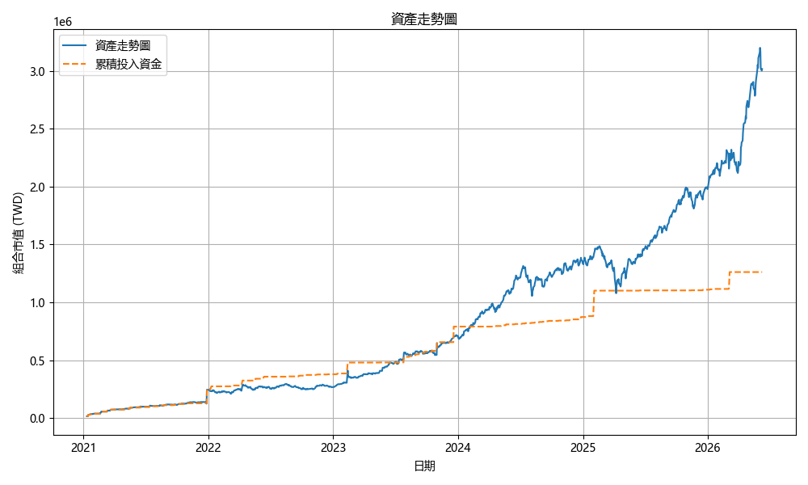

### Daily Asset Allocation
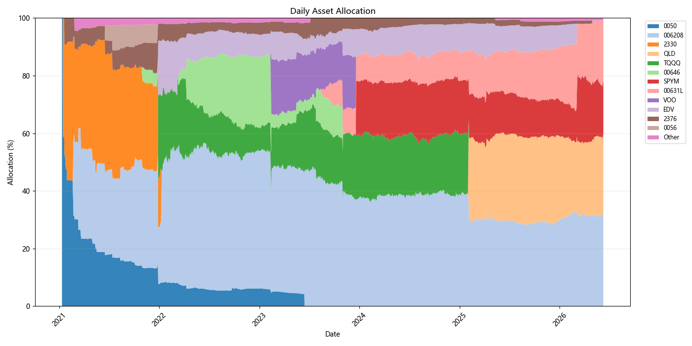

### Funding Ratio
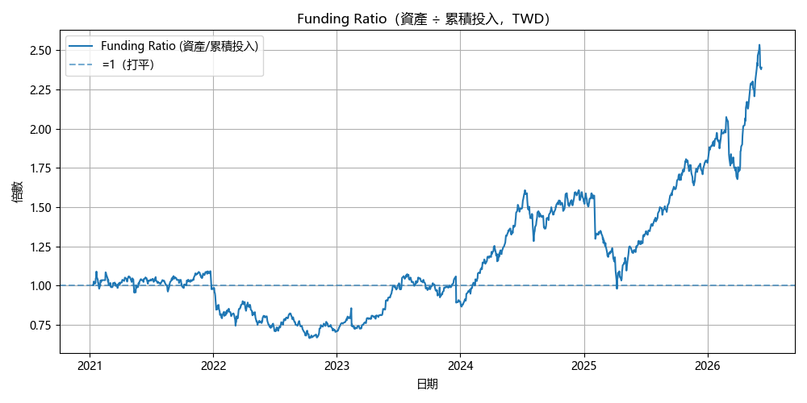

### Portfolio TWR
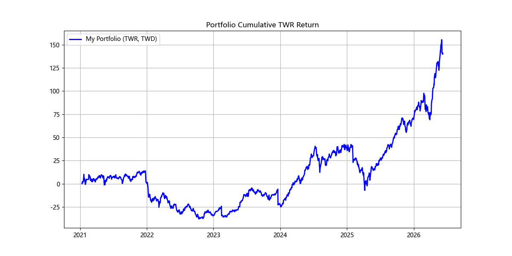

### Cumulative Return Comparison
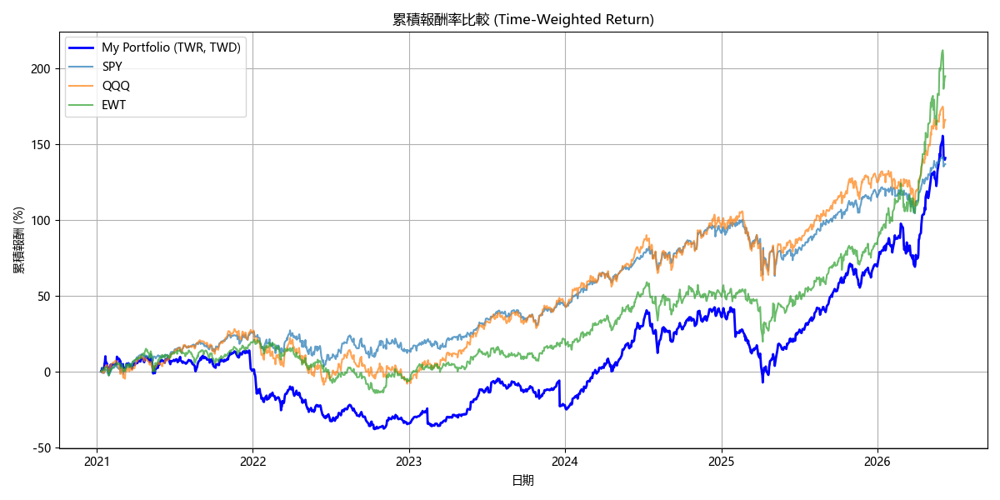

### Portfolio vs Benchmark USD
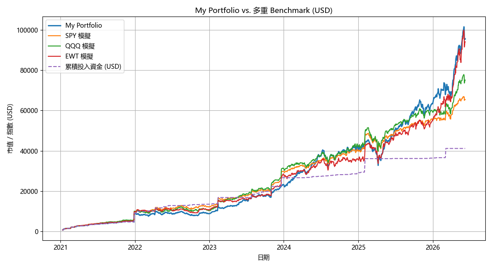

### Drawdown Underwater
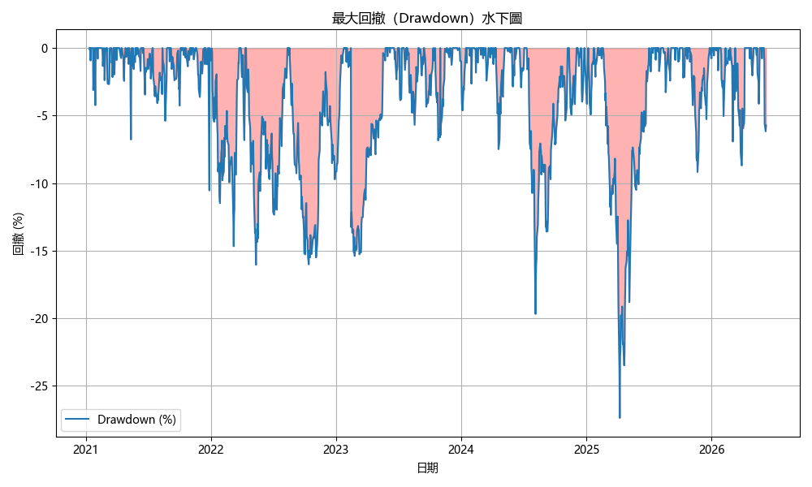

### Cashflow Drawdown Comparison
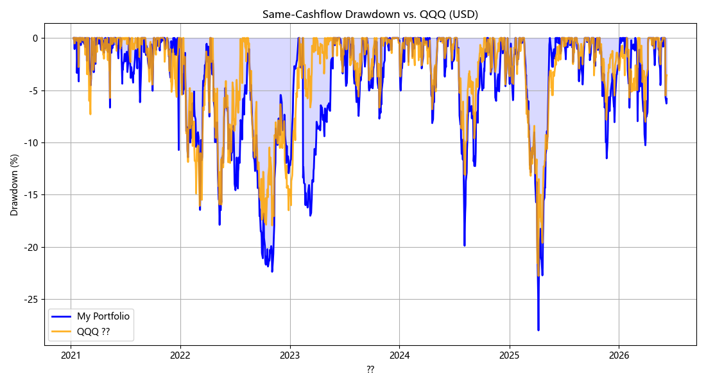

### Cashflow Drawdown Spread vs QQQ
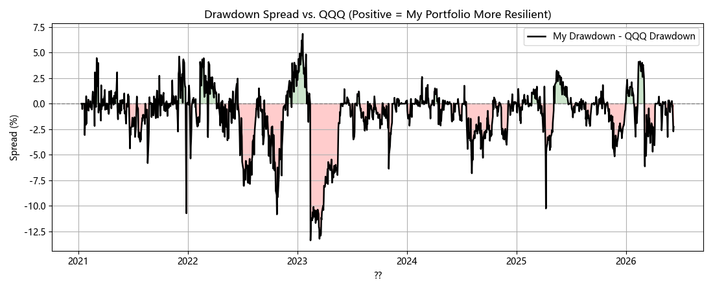

### Asset Pie Chart
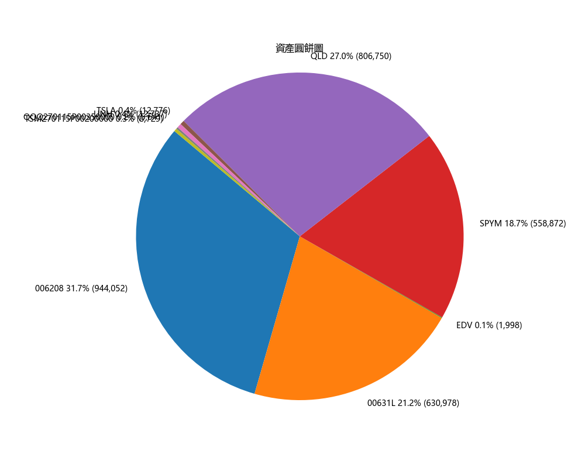

### Monthly Investment
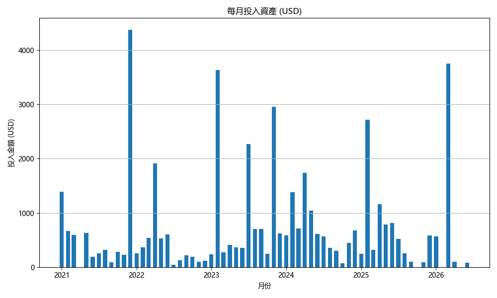

### Stock Performance
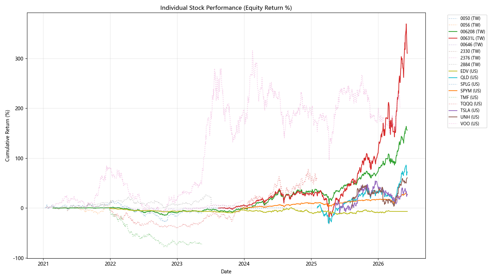

### Put Protection Full Portfolio Stress
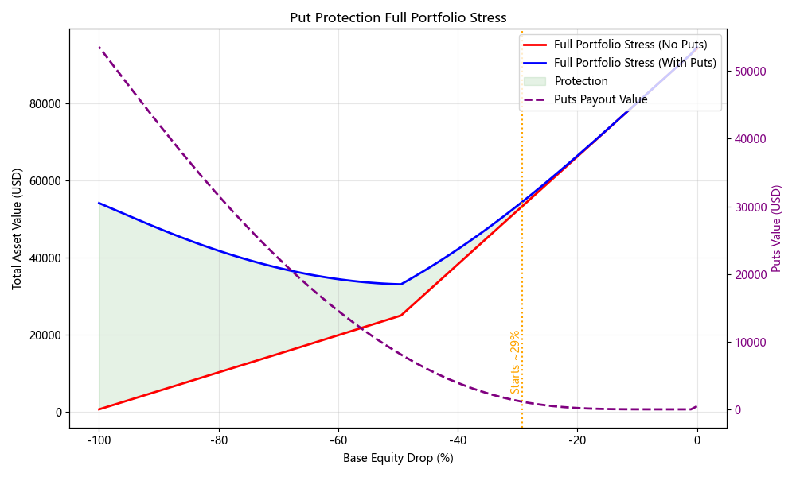

## Execution Summary
- Cache Loads: 54
- Cache Misses (Network Fetches): 0
- Price Calibrations Applied: 8
