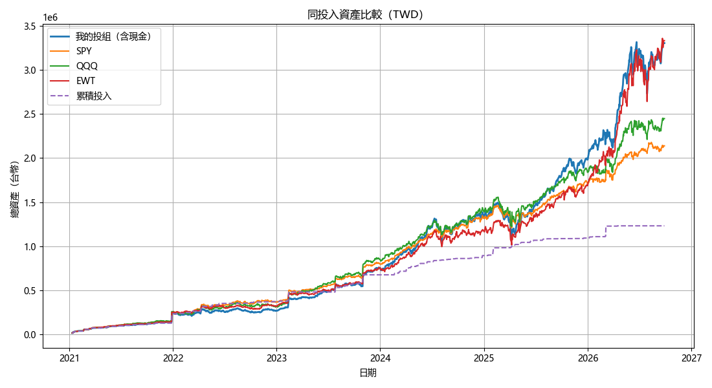

# 投資組合報告

> 台美合併投組・金額以新台幣計｜估值期間 2021-01-11～2026-09-28

## 資產總覽

| 項目             | 金額               |
|------------------|--------------------|
| 總資產（含現金） | 3,302,393 元       |
| 累積投入         | 1,231,553 元       |
| 總獲利           | +2,070,840 元      |
| 現金（推算）     | 49,292 元（1.49%） |

## 與單買 ETF 比較

使用相同外部投入日期與金額。XIRR 是資金加權年化報酬；最大回撤與 Sharpe 由 TWR 計算。

| 標的     | 期末總資產   | 總獲利     | XIRR   | 最大回撤   |   Sharpe |
|----------|--------------|------------|--------|------------|----------|
| 我的投組 | 3,302,393    | +2,070,840 | 34.64% | 41.08%     |     0.91 |
| SPY      | 2,138,079    | +906,526   | 18.97% | 18.85%     |     0.84 |
| QQQ      | 2,446,897    | +1,215,344 | 23.75% | 28.78%     |     0.78 |
| EWT      | 3,330,877    | +2,099,324 | 34.96% | 29.15%     |     0.89 |

## 現在配置

| 持倉               | 市值      | 占總資產   |
|--------------------|-----------|------------|
| 006208             | 1,044,025 | 31.61%     |
| QLD                | 847,993   | 25.68%     |
| 00631L             | 725,625   | 21.97%     |
| SPYM               | 586,265   | 17.75%     |
| 現金（推算）       | 49,292    | 1.49%      |
| 00646              | 21,580    | 0.65%      |
| SPCX               | 14,187    | 0.43%      |
| TSLA               | 11,835    | 0.36%      |
| QQQ270115P00350000 | 1,113     | 0.03%      |
| TSM270115P00220000 | 477       | 0.01%      |

## 歷史表現

### 累積報酬比較

排除外部投入的影響，觀察投資報酬本身。

### 配置變化

### 距離歷史高點的跌幅

## Put 持倉

| 標的   | 到期日     |   履約價（美元） | 市值（台幣）   |
|--------|------------|------------------|----------------|
| QQQ    | 2027-01-15 |              350 | 1,113          |
| TSM    | 2027-01-15 |              220 | 477            |

Put 的市值已計入上方總資產；到期給付與到期前市值不同。

## 詳細資料與計算前提

[完整損益、再平衡與避險試算](report_details.md) · [逐日現金帳本](combined_cash_ledger.csv)

- 台美共用推算現金，買入先扣現金，不足才算新投入；未記錄提款，故淨投入等於累積投入。現金以台幣記帳、不計息。

- ETF 模擬含股息再投入，未扣個人股息稅及交易費；估值使用可得行情，並非全部即時報價。

- Put 歷史估值資料有限，歷史風險與避險試算需配合詳細報表的模型假設判讀。
