## 綜合資產配置報告 (單位: USD)

- **證券市值**：102,278.82 USD
- **投組現金（推算）**：1,549.76 USD
- **現金占總資產**：1.49%
- **累積外部投入金額**：40,251.21 USD
- **實際淨投入資金**：40,251.21 USD
- **最終組合市值**：103,828.59 USD
- **總獲利**：63,577.37 USD
- **總獲利百分比**：157.95%
- **AnnVol**：21.52%
- **MaxDD**：49.12%
- **Sharpe**：0.79
- **Sortino Ratio**：1.12
- **Calmar Ratio**：0.37
- **綜合 XIRR**：32.40%

## 綜合資產配置報告 (單位: TWD)

- **證券市值**：3,253,100.74 TWD
- **投組現金（推算）**：49,292.10 TWD
- **現金占總資產**：1.49%
- **累積外部投入金額**：1,231,552.91 TWD
- **實際淨投入資金**：1,231,552.91 TWD
- **最終組合市值**：3,302,392.84 TWD
- **總獲利**：2,070,839.93 TWD
- **總獲利百分比**：168.15%
- **AnnVol**：20.76%
- **MaxDD**：41.08%
- **Sharpe**：0.91
- **Sortino Ratio**：1.31
- **Calmar Ratio**：0.50
- **綜合 XIRR**：34.64%

現金與投入依台美合併交易推算：同日淨額結算、先用現金再補投入；未記錄提款，現金以台幣記帳且不計息。總資產含現金。
Benchmark 使用相同外部投入並全額投資；調整價格含股息再投入，未扣個人股息稅與交易費。持股明細占比以證券市值為分母。

## 綜合投資組合股票明細 (TWD)
| Symbol             | Name               |   Quantity_now |     Price | AvgCost   |   Price_Total |      Cost | Price PnL(USD)                                                  | Price PnL(TWD)                                                   | Dividend(USD)                                                  | Dividend(TWD)                                                   | Total PnL(USD)                                                  | Total PnL(TWD)                                                   | Total PnL(%)                                                  | Alloc(%)           |
|--------------------|--------------------|----------------|-----------|-----------|---------------|-----------|-----------------------------------------------------------------|------------------------------------------------------------------|----------------------------------------------------------------|-----------------------------------------------------------------|-----------------------------------------------------------------|------------------------------------------------------------------|---------------------------------------------------------------|--------------------|
| 0050               | 0050               |              0 |   0       |           |         0     |   739.039 | -40.25    | -1,280.11  | 42.87    | 1,270.00  | 2.62      | -10.11     | 0.35%   | 0.00% (0)          |
| 2330               | 台積               |              0 |   0       |           |         0     |  1421.47  | 128.89    | 4,099.59   | 21.89    | 611.00    | 150.79    | 4,710.59   | 10.61%  | 0.00% (0)          |
| 2376               | 技嘉               |              0 |   0       |           |         0     |   311.776 | 551.42    | 17,538.70  | 71.47    | 2,245.00  | 622.89    | 19,783.70  | 199.79% | 0.00% (0)          |
| 006208             | 006208             |           4047 |   8.07547 | 2.68      |     32681.4   | 10858.6   | 21,822.85 | 694,101.84 | 1,961.42 | 62,129.00 | 23,784.27 | 756,230.84 | 171.22% | 32.00% (1,039,472) |
| 2884               | 玉山金             |              0 |   0       |           |         0     |   209.043 | 7.46      | 237.12     | 22.42    | 721.00    | 29.88     | 958.12     | 14.29%  | 0.00% (0)          |
| 0056               | 0056               |              0 |   0       |           |         0     |   337.345 | -10.68    | -339.53    | 17.50    | 486.00    | 6.83      | 146.47     | 2.02%   | 0.00% (0)          |
| 00646              | 元大SP&500         |            280 |   2.42563 | 2.77      |       679.176 |   776.032 | -96.86    | -3,080.61  | 0.00                                                           | 0.00                                                            | -96.86    | -3,080.61  | -2.02%  | 0.66% (21,602)     |
| 00631L             | 00631L             |          18668 |   1.22209 | 0.16      |     22814     |  2998.53  | 19,815.42 | 630,253.22 | 0.00                                                           | 0.00                                                            | 19,815.42 | 630,253.22 | 361.06% | 22.34% (725,625)   |
| TQQQ               | TQQQ               |              0 |   0       |           |         0     |  6175.88  | 3,441.68  | 109,466.76 | 138.50   | 4,405.16  | 3,580.18  | 113,871.92 | 57.97%  | 0.00% (0)          |
| EDV                | EDV                |              0 |   0       |           |         0     |  7383.06  | -787.44   | -25,045.47 | 393.48   | 12,515.10 | -393.96   | -12,530.37 | -5.34%  | 0.00% (0)          |
| TMF                | TMF                |              0 |   0       |           |         0     |    57.79  | -42.06    | -1,337.77  | 0.00                                                           | 0.00                                                            | -42.06    | -1,337.77  | -72.78% | 0.00% (0)          |
| VOO                | VOO                |              0 |   0       |           |         0     |  3425.97  | 507.63    | 16,145.78  | 25.17    | 800.56    | 532.80    | 16,946.34  | 15.55%  | 0.00% (0)          |
| SPYM               | SPYM               |            203 |  90.8     | 68.19     |     18432.4   | 13842     | 4,590.39  | 146,002.88 | 185.99   | 5,915.64  | 4,776.38  | 151,918.52 | 32.06%  | 18.05% (586,265)   |
| QLD                | QLD                |            275 |  96.95    | 54.05     |     26661.2   | 14863.8   | 11,797.48 | 375,232.98 | 46.95    | 1,493.30  | 11,844.43 | 376,726.28 | 79.69%  | 26.10% (847,993)   |
| TSLA               | TSLA               |              1 | 372.11    | 317.37    |       372.11  |   317.37  | 54.74     | 1,741.07   | 0.00                                                           | 0.00                                                            | 54.74     | 1,741.07   | 17.25%  | 0.36% (11,835)     |
| UNH                | UNH                |              0 |   0       |           |         0     |   253.2   | 156.92    | 4,991.03   | 6.74     | 214.37    | 163.66    | 5,205.40   | 64.64%  | 0.00% (0)          |
| QQQ270115P00350000 | QQQ270115P00350000 |            100 |   0.35    | 3.60      |        35     |   359.66  | -324.66   | -10,326.20 | 0.00                                                           | 0.00                                                            | -324.66   | -10,326.20 | -90.27% | 0.03% (1,113)      |
| TSM270115P00200000 | TSM270115P00200000 |              0 |   0       |           |         0     |   825.66  | -592.32   | -18,839.45 | 0.00                                                           | 0.00                                                            | -592.32   | -18,839.45 | -71.74% | 0.00% (0)          |
| SPCX               | SPCX               |              3 | 148.68    | 173.89    |       446.04  |   521.68  | -75.64    | -2,405.82  | 0.00                                                           | 0.00                                                            | -75.64    | -2,405.82  | -14.50% | 0.44% (14,187)     |
| TSM270115P00220000 | TSM270115P00220000 |            100 |   0.15    | 3.13      |        15     |   312.66  | -297.66   | -9,467.43  | 0.00                                                           | 0.00                                                            | -297.66   | -9,467.43  | -95.20% | 0.01% (477)        |

## 投組 vs. Benchmark 總表 (TWD)
| Asset        | Final Value (TWD)   | Profit (TWD)                                                       | Profit %                                                      | XIRR %                                                       | AnnVol %   | MaxDD %   |   Sharpe |
|--------------|---------------------|--------------------------------------------------------------------|---------------------------------------------------------------|--------------------------------------------------------------|------------|-----------|----------|
| My Portfolio | 3,302,392.84        | 2,070,839.93 | 168.15% | 34.64% | 20.76%     | 41.08%    |     0.91 |
| SPY          | 2,138,079.07        | 906,526.17   | 73.61%  | 18.97% | 17.88%     | 18.85%    |     0.84 |
| QQQ          | 2,446,896.98        | 1,215,344.08 | 98.68%  | 23.75% | 23.21%     | 28.78%    |     0.78 |
| EWT          | 3,330,876.79        | 2,099,323.88 | 170.46% | 34.96% | 24.35%     | 29.15%    |     0.89 |

## Target Allocation And Rebalance Suggestion
Rebalance capital pool (stocks only): 3,220,957 TWD
|               Asset |   Target % |   Current % |   Current Amount (TWD) |   Target Amount (TWD) |                                         Suggested Action (TWD) |
|---------------------|------------|-------------|------------------------|-----------------------|----------------------------------------------------------------|
|                 QLD |      30.0% |       26.3% |                847,993 |               966,287 | +118,294 |
| SPLG / SPYM / 00646 |      25.0% |       18.9% |                607,867 |               805,239 | +197,373 |
|              00631L |      15.0% |       22.5% |                725,625 |               483,144 | -242,482 |
|              006208 |      30.0% |       32.3% |              1,039,472 |               966,287 |  -73,185 |
Stock performance chart saved to output/stock_performance.png
圖表已儲存至 output/put_position_history.png

## 代理避險情境保護率
QQQ Put 對應美股風險曝險；TSM Put 對應台股風險曝險。保護率用履約價計算：Put payout / 資產池情境損失。
| Proxy Put | 對應資產池 | 保費成本率 | -30% 保護率 | -50% 保護率 | -90% 保護率 |
| :--- | :--- | ---: | ---: | ---: | ---: |
| QQQ Put | 美股風險曝險 | 0.50% | 0.0% | 0.0% | 42.3% |
| TSM Put | 台股風險曝險 | 0.40% | 0.0% | 0.0% | 24.6% |

### Put 成本紀錄
保費是成本紀錄；重設組合用履約價 / 今日標的價約 50% 的災難保險規則，並用即時 option chain 估算成本。
| 項目 | 數值 |
| :--- | ---: |
| 投組市值 | $103,829 |
| 累積獲利 | $63,577 |
| 目前 Put 已投入保費 | $672 |
| 目前 Put 市值（可抵扣重設成本） | $50 |
| Put 已投入保費 / 投組市值 | 0.65% |

### Put 重設避險組合
數學規則：出清/抵扣現有 Put 後，重新建立履約價 / 今日標的價最接近 50% 的 Put；這是深價外災難保險，不保證 -50% 情境有固定保護率。
| Proxy Put | 對應資產池 | 原買入日 | 原標的價 | 原履約價 | 原履約價/原標的價 | 原 Put 成本 | 今日原 Put 市值 | 今日標的價 | 目前保護率 | 重設到期日 | 目標履約價 | 重設履約價 | 重設履約價/今日標的價 | 張數 | 重設 Put 現價 | 重設毛成本 | 淨重設成本 | 重設後 -90% 保護率 |
| :--- | :--- | :--- | ---: | ---: | ---: | ---: | ---: | ---: | :--- | :--- | ---: | ---: | ---: | ---: | ---: | ---: | ---: | ---: |
| QQQ Put | 美股風險曝險 | 2026-01-07 | $624 | $350 | 56.1% | $360 | $35 | $744 | -50% 0.0%，-90% 42.3% | 2027-09-17 | $372 | $370 | 49.7% | 1 | $3.53 (ask) | $353 | $318 | 45.4% |
| TSM Put | 台股風險曝險 | 2026-07-01 | $444 | $220 | 49.5% | $313 | $15 | $451 | -50% 0.0%，-90% 24.6% | 2027-09-17 | $225 | $230 | 51.0% | 1 | $3.30 (ask) | $330 | $315 | 26.0% |
圖表已儲存至 output/proxy_hedge_coverage.png

## Put 避險保護分析
這是全投組壓力測試：先依資產類型規則衝擊目前所有非 Put 持倉，再重估現有 Put 價值並加回總資產。
Put：QQQ270115P00350000，履約價 $350.0，到期日 2027-01-15（標的：QQQ @ $744.50）
Put：TSM270115P00220000，履約價 $220.0，到期日 2027-01-15（標的：TSM @ $450.61）
目前非 Put 資產：$102,086 USD
目前 Put 市值：$50 USD
| Put | 標的 | 目前市值 | Put 名目金額 |
| :--- | :--- | ---: | ---: |
| QQQ270115P00350000 | QQQ | $35 | $74,450 |
| TSM270115P00220000 | TSM | $15 | $45,061 |
| 持倉 | 目前市值 | 壓力測試規則 |
| :--- | ---: | :--- |
| 006208 | $32,681 | 一般股票曝險 |
| QLD | $26,661 | 2 倍股票曝險 |
| 00631L | $22,814 | 2 倍股票曝險 |
| SPYM | $18,432 | 一般股票曝險 |
| 00646 | $679 | 一般股票曝險 |
| SPCX | $446 | 一般股票曝險 |
| TSLA | $372 | 高 Beta 股票 1.5 倍 |
| 情境 | 基準漲跌幅 | 總資產（未避險） | 總資產（含 Put） | Put 總價值 | 保護效果 |
| :--- | :--- | :--- | :--- | :--- | :--- |
| 翻倍上漲 | 100% | $253,834 | **$253,834** | $0 | $0 |
| 大幅上漲 | 90% | $238,659 | **$238,659** | $0 | $0 |
| 強勢上漲 | 80% | $223,484 | **$223,484** | $0 | $0 |
| 明顯上漲 | 70% | $208,310 | **$208,310** | $0 | $0 |
| 延續上漲 | 60% | $193,135 | **$193,135** | $0 | $0 |
| 大漲 | 50% | $177,960 | **$177,960** | $0 | $0 |
| 強漲 | 40% | $162,785 | **$162,785** | $0 | $0 |
| 上漲 | 30% | $147,611 | **$147,611** | $0 | $0 |
| 溫和上漲 | 20% | $132,436 | **$132,436** | $0 | $0 |
| 小漲 | 10% | $117,261 | **$117,261** | $0 | +$0 |
| 目前 | 0% | $102,086 | **$102,136** | $50 | +$50 |
| 修正 | -10% | $86,912 | **$86,912** | $0 | +$0 |
| 熊市 | -20% | $71,737 | **$71,752** | $15 | +$15 |
| 崩跌 | -30% | $56,562 | **$56,897** | $335 | +$335 |
| 危機 | -40% | $41,387 | **$43,331** | $1,944 | +$1,944 |
| 重挫 | -50% | $26,707 | **$32,611** | $5,903 | +$5,903 |
| 深度重挫 | -60% | $21,428 | **$34,006** | $12,579 | +$12,579 |
| 極端崩跌 | -70% | $16,170 | **$37,850** | $21,680 | +$21,680 |
| 系統性危機 | -80% | $10,946 | **$43,486** | $32,539 | +$32,539 |
| 近乎歸零 | -90% | $5,722 | **$50,021** | $44,298 | +$44,298 |
| 歸零壓力 | -100% | $498 | **$56,745** | $56,246 | +$56,246 |
圖表已儲存至 output/total_asset_protection.png
圖表已儲存至 output/put_stock_hedge_effect.png

## Charts

### Asset Trend
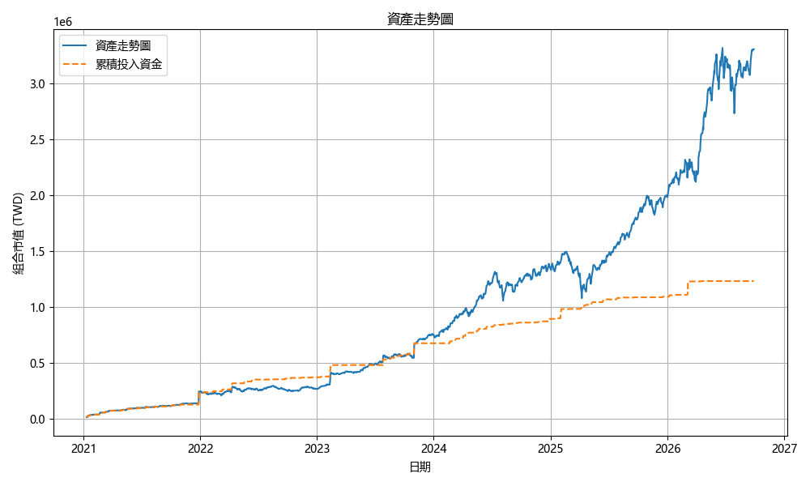

### Daily Asset Allocation
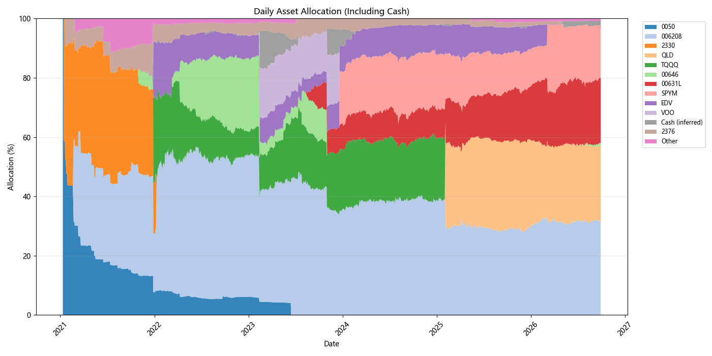

### Funding Ratio
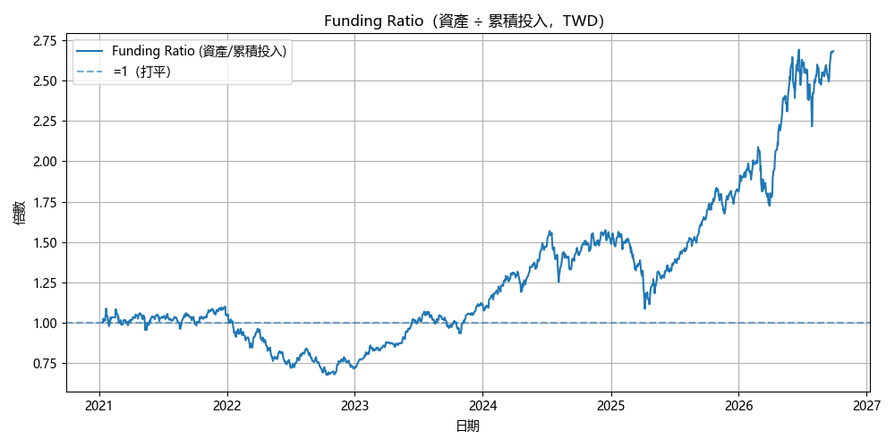

### Portfolio TWR
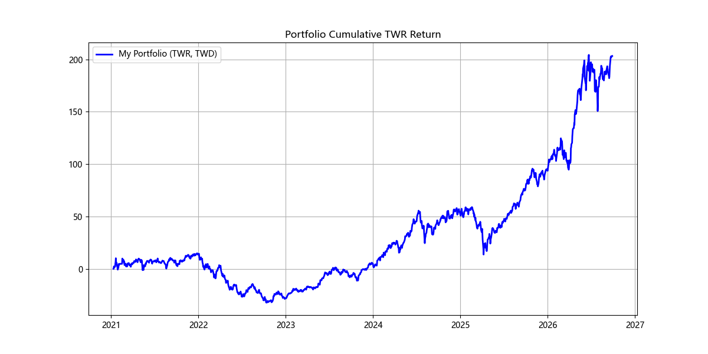

### Cumulative Return Comparison
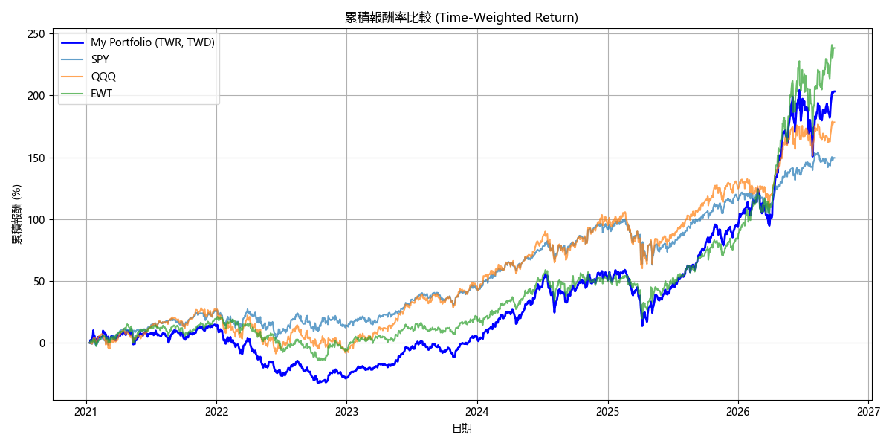

### Portfolio vs Benchmark USD
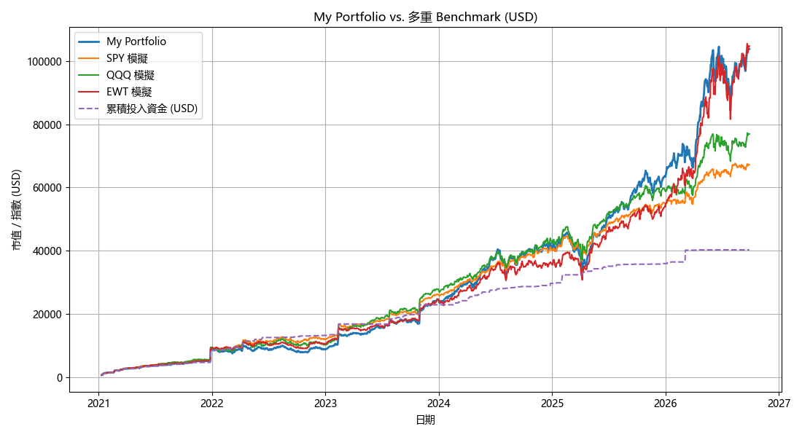

### Drawdown Underwater
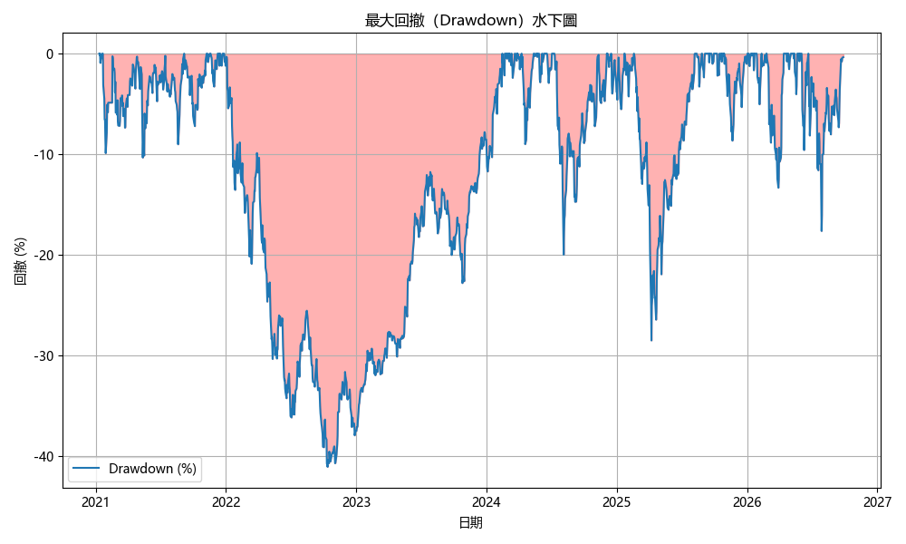

### Cashflow Drawdown Comparison
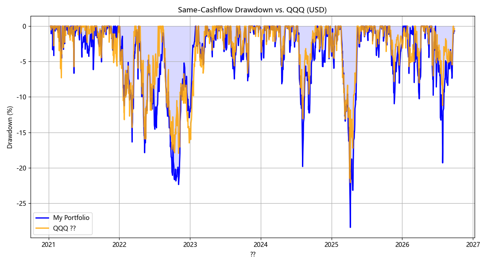

### Cashflow Drawdown Spread vs QQQ
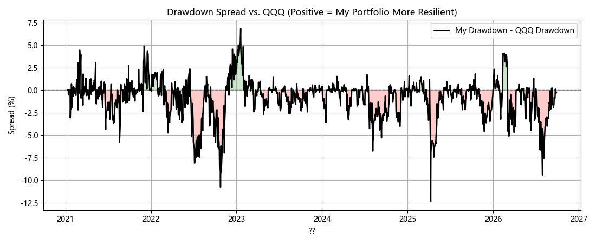

### Asset Pie Chart
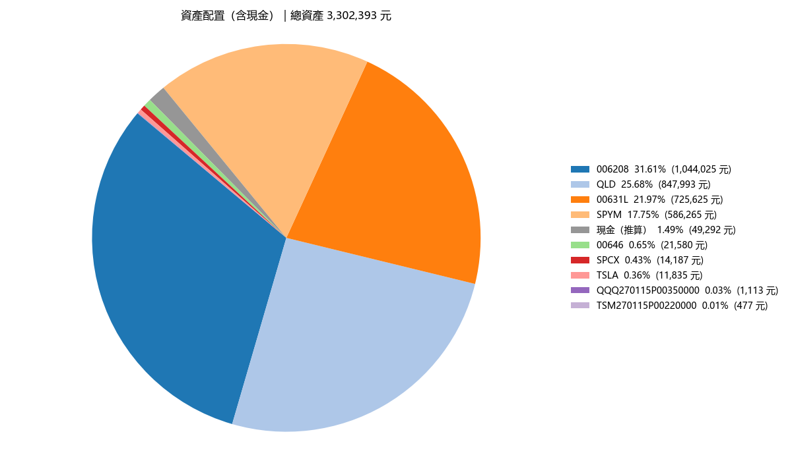

### Monthly Investment
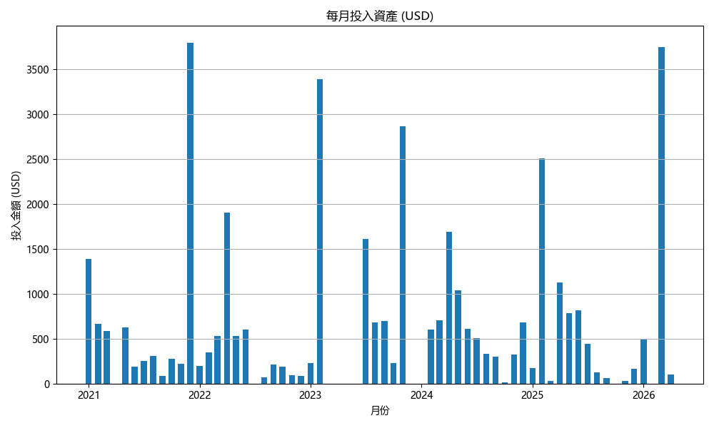

### Stock Performance
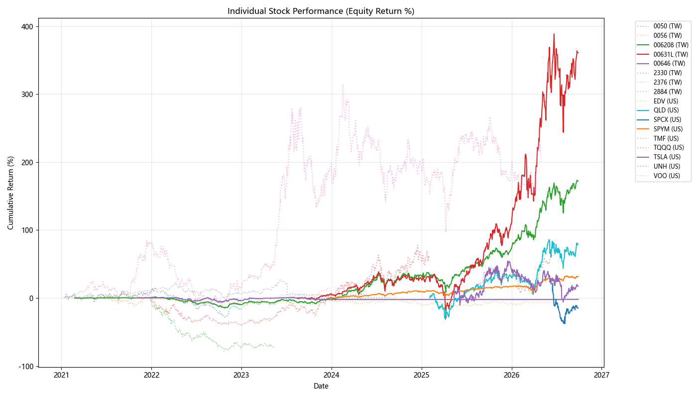

### Put Position Value History
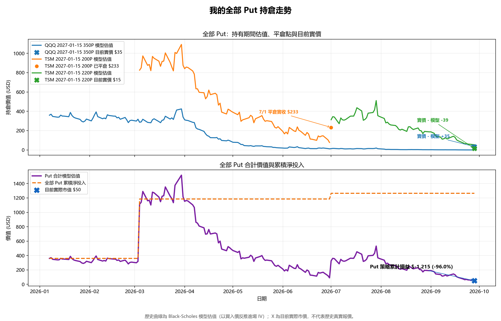

### Put vs Stock Hedge Effect
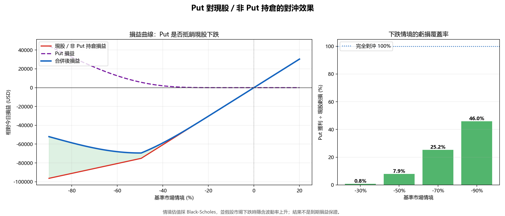

### 代理避險情境保護率
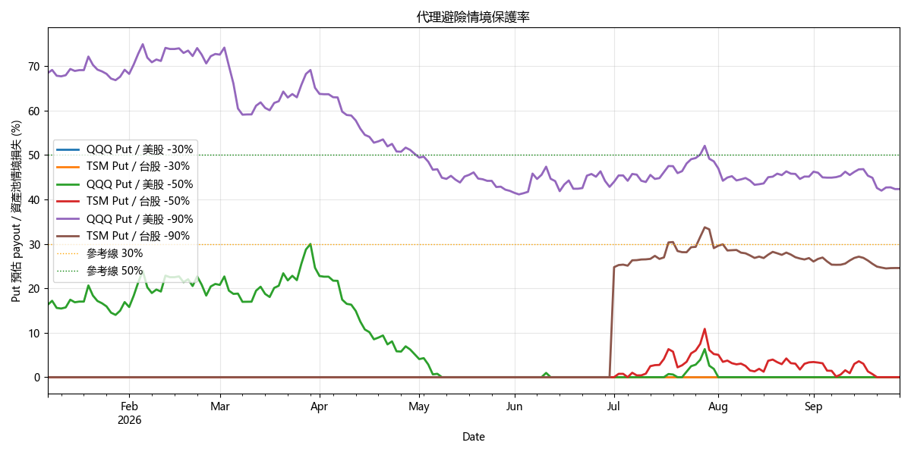

### Put 避險保護全投組壓力測試
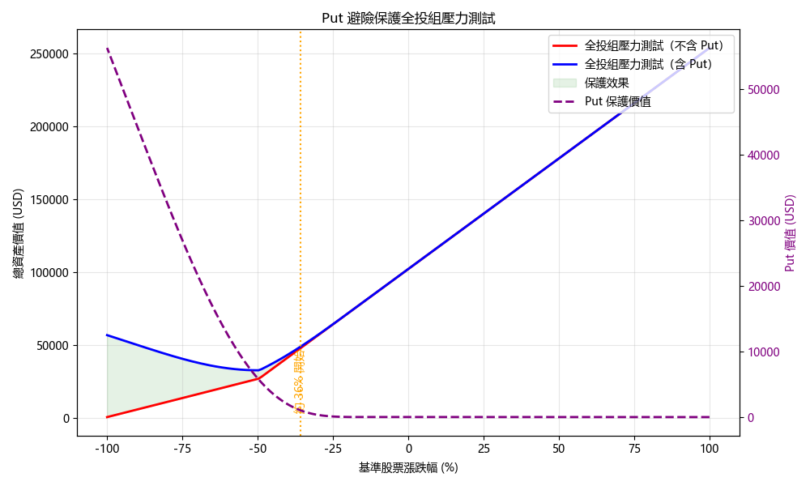

## Execution Summary
- Cache Loads: 62
- Cache Misses (Network Fetches): 0
- Price Calibrations Applied: 8
